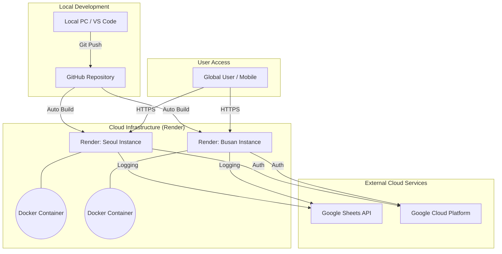

# 🏗️ SmartFarm Live: 클라우드 통합 아키텍처 (Architecture)

본 문서는 **SmartFarm Live** 시스템이 GitHub, Docker, Render, Google Cloud를 결합하여 전 세계 어디서든 실시간 제어가 가능한 글로벌 인프라를 구축하는 원리와 과정을 상세히 설명합니다.

---

## 1. 시스템 개념도 (System Concept)

본 시스템은 **"한 번의 코드 작성으로 무한한 확장(Scale-out)"**이 가능한 클라우드 네이티브 구조를 지향합니다.

---

## 2. 핵심 기술 스택 및 역할 (Tech Stack)

### 📂 코드 관리: GitHub
*   **Source of Truth**: 모든 시스템 로직과 설정의 원천입니다.
*   **CI/CD Pipeline**: 코드가 푸시되면 Render 서버가 이를 감지하여 자동으로 빌드 및 배포를 수행하는 트리거 역할을 합니다.

### 🐳 가상화: Docker
*   **Environment Aggregation**: Python 실행 환경, OpenCV 종속성, 라이브러리를 하나의 레이어로 캡슐화합니다.
*   **Consistency**: "사용자 PC"와 "싱가포르 Render 서버"가 100% 동일한 환경에서 동작하도록 보장하여 환경 차이로 인한 오류를 원천 차단합니다.

### 🚀 서버 호스팅: Render (Cloud PaaS)
*   **Serverless Ease**: 물리 서버 관리 없이 Docker 이미지를 전 세계(싱가포르 등)에 배포합니다.
*   **Dynamic Routing**: 각 농장 인스턴스에 고유한 도메인(`onrender.com`)을 부여하여 전 세계 어디서든 웹 접속을 가능하게 합니다.

### 📗 데이터 허브: Google Cloud & Sheets
*   **Persistence**: Render 서버 재시작 시 사라지는 내부 데이터를 외부 저장소인 구글 시트에 영구 기록합니다.
*   **Accessibility**: 별도의 복잡한 데이터베이스 뷰어 없이도, 관리자가 스마트폰 구글 시트 앱을 통해 실시간 지표를 조회할 수 있습니다.

---

## 3. 실시간 제어 흐름 (Control Workflow)

전 세계 어디서든 버튼을 클릭하여 농장의 기기를 제어하는 과정은 다음과 같습니다.

1.  **사용자 요청 (Command Request)**: 
    *   사용자가 웹 대시보드에서 `냉각기 켜기` 버튼을 누르면 HTTPS POST 요청이 Render 서버로 전달됩니다.
2.  **명령 처리 (Signal Processing)**: 
    *   **Render(Docker)** 내의 Python 서버는 요청을 해석하고, 해당 구역(Zone)의 액추에이터 상태를 `ACTIVE`로 변경합니다.
3.  **통신 캐리어 (MQTT Gateway)**:
    *   서버는 MQTT 브로커를 통해 농장 현장에 설치된 **ESP32 게이트웨이**로 제어 신호를 전송합니다. (현재 시뮬레이션 환경에서는 가상 노드 레지스트리 업데이트로 수행)
4.  **상태 기록 (Persistence)**:
    *   변경된 상태값은 즉시 **Google Sheets**로 전송되어 기록되며, 동시에 대시보드의 상태 UI가 실시간으로 갱신됩니다.

---

## 4. 데이터 효율화 및 보안 (Efficiency & Security)

### 📈 데이터 관리 전략
*   **10분 주기 기록**: 무분별한 데이터 축적을 막고 구글 API의 할당량을 효율적으로 사용하기 위해 10분(테스트 시 1분) 간격으로 데이터를 모아서 배치(Batch) 업데이트를 수행합니다.
*   **월별 로테이션**: 로컬 서버에는 `tsdb_YYYY_MM.csv` 형태로 파일을 생성하여, 시간이 지나도 데이터 조회 속도가 느려지지 않도록 설계되었습니다.

### 🔐 보안 메커니즘
*   **Secret Management**: 구글 인증키(`my_secret_key.json`)는 GitHub에 노출되지 않도록 `.gitignore` 처리되며, 클라우드 서버의 **Secret Files** 환경을 통해 안전하게 주입됩니다.
*   **Push Protection**: GitHub의 비밀번호 유출 탐지 기능을 활용하여 보안 사고를 사전에 예방합니다.

---

## 5. 결론: 비즈니스 가치 (Business Value)

이 아키텍처를 통해 관리자는 **PC 한 대와 인터넷만 있다면** 전 세계 수백 개의 농장을 하나의 코드로 완벽하게 중앙 제어할 수 있는 **SaaS(Software as a Service) 기반 스마트팜 인프라**를 소유하게 되었습니다.
